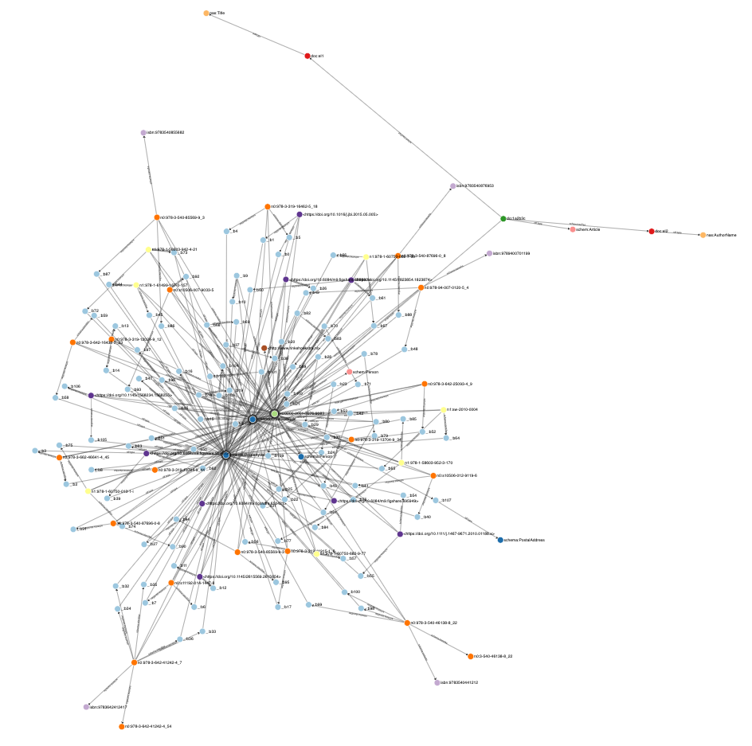
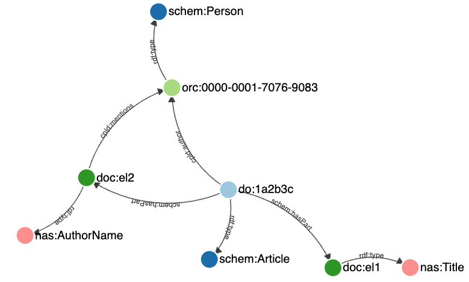
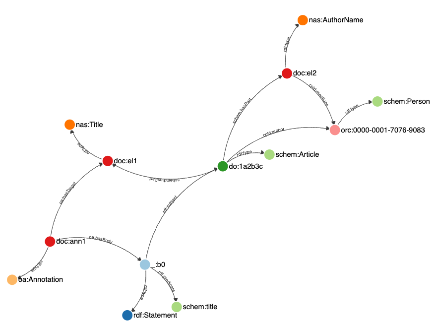

# CP/LD Tutorial
##### By *Rinke Hoekstra*

## Introduction

This is a step-by step introduction to creating your first Linked Document that is conformant to the CP/LD standard.

It makes sense to use [VSCode](https://code.visualstudio.com) and the [CP/LD Viewer](https://marketplace.visualstudio.com/items?itemName=Elsevier.cpld-viewer) extension to test your code.

## Basics

The CP/LD standard describes a mechanism for combining HTML5 for content (i.e. scientific articles, books, anything) with Linked Data, that is very similar to Google Structure Data, and microformats such as RDFa. The main difference is that where Google Structured Data is meant to facilitate the situation where the HTML and Linked Data capture the *same* information, CP/LD is there to capture *metadata* about the HTML. 

CP/LD uses HTML (https://html.spec.whatwg.org) for content structure, and JSON-LD to represent Linked Data, if you're not familiar with JSON-LD it makes sense to peruse the introductory material at <https://json-ld.org>. The JSON-LD specification lives at <https://www.w3.org/TR/json-ld/>

To get going, we will need 1) an HTML file (`example1.html`) and 2) a JSON-LD file that captures the Linked Data (`example1.jsonld`).

### The HTML

Let's have a look at the basic HTML structure of `example1.html`. To turn this into a Linked Document, we need to add the following information to the HTML:

1. We first mint a document *identifier* for the linked document. Ideally this is a [dereferenceable IRI](https://www.w3.org/TR/cooluris/), and it should be an HTTPS IRI. Let's use the following IRI:
   ```
   https://cpld.example.com/document/3a2b3c
   ```
2. The document type tells any reader (e.g. a browser) that this is uses the latest version of HTML.
   ```html
   <!DOCTYPE html>
   ```
3. The `xml:base` attribute tells XML and HTML parsers that any local identifiers in the HTML (e.g. the value of an `id` attribute) can be turned into an absolute URI by prepending the value of the `xml:base` attribute. We use the identifier we minted earlier.
    ```html
    <html xmlns="http://www.w3.org/1999/xhtml" xml:base="https://cpld.example.com/document/3a2b3c">
    ```
    The `xmlns` definition is there to ensure that XML parsers use the correct namespace.
4. Inside the `<head>` of the HTML file, a `<meta>` element specifies the document identifier:
   ```html
   <meta name="id" content="https://cpld.example.com/document/3a2b3c" />
   ```
5. Inside the `<head>` of the HTML file, a `<link>` element defines the `dcterms` namespace schema as prefix for the `http://purl.org/dc/terms` namespace.
    ```html
    <link rel="schema.dcterms" href="http://purl.org/dc/terms/" />
    ```
6. This allows us to then use the `dct` prefix tor stating conformance using the `<meta>` element. We use the pattern described by the [Dublin Core](https://www.dublincore.org/specifications/dublin-core/dc-html/) consortium (note the dot-notation, instead of a colon). **NB** We may also choose to adopt RDFa prefixes instead:
   ```html
   <meta name="dcterms.conformsTo" content="https://cpld.example.com/schema/cpld/" />
   ```
   Note that the value of the `content` attribute should point to the official CP/LD namespace. Additional conformance statements may be added, but this one is required.
7. Finally, we insert a `<link>` element that points to the JSON-LD file that contains the Linked Data that describes this document:
   ```html
   <link type="application/ld+json" rel="describedby" href="tutorial1.jsonld" />
   ```

The `<head>` may contain any other standard HTML elements, such as style information, scripts. It is recommended to not include the code inline, but point at external files using `<link>` and `<script>` elements.

In code:

```html
<!DOCTYPE html>
<html xmlns="http://www.w3.org/1999/xhtml" xml:base="https://cpld.example.com/document/3a2b3c">
    <head>
        <meta name="id" content="https://cpld.example.com/document/3a2b3c" />
        <link rel="schema.dcterms" href="http://purl.org/dc/terms/" />
        <meta name="dcterms.conformsTo" content="https://cpld.example.com/schema/cpld/" />
        <link type="application/ld+json" rel="describedby" href="example1.jsonld" />
    </head>
    <body>
    </body>
</html>
```

### The JSON-LD

The basic structure of the JSON-LD file (`example1.jsonld`) needs the following information:

1. We link to the CP/LD context to make our JSON-LD easier to read. The context defines namespace prefixes, and helps the parser interpret the JSON as linked data. The context will be hosted at a predictable location, but for now we'll use the `cpld-niso-context.jsonld` in this repository:
   ```json
   "@context": "cpld-niso-context.jsonld",
   ```
2. The context also needs to map the document identifier to the reserved `doc` namespace:
   ```json
   "@context": [
    "cpld-niso-context.jsonld",
    { "doc": "https://cpld.example.com/document/1a2b3c#" }
   ],
   ```
3. With the context in place, we can start the actual linked data by specifying the main resource: the document:
    ```json
    "id": "https://cpld.example.com/document/1a2b3c",
    ```
4. We specify (again) that the document conforms to the CP/LD standard:
    ```json
    "conformsTo": "http://cpld.example.com/schema/cpld/",
    ```
5. And we specify the type of the document, in this case a [`schema:Article`](https://schema.org/Article):
   ```json
   "type": "schema:Article"
   ```


The complete example:

```json
{
    "@context": [
        "cpld-niso-context.jsonld", 
        { "doc": "https://cpld.example.com/document/1a2b3c#" } 
    ],
    "id": "https://cpld.example.com/document/1a2b3c",
    "conformsTo": "http://cpld.example.com/schema/cpld/",
    "type": "schema:Article"
}
```

The RDF graph:


## Linking Data and Content

Now that the basics are in place, we can start adding content, and describe it in our data. 

#### The HTML

For instance, suppose we add a couple of elements to the `<body>` of the HTML:

```html
<h1>CP/LD Tutorial</h1>
<h5>By <em>Rinke Hoekstra</em></h5>

<h2>Introduction</h2>
<p>This is a step-by step introduction to creating your first Linked Document that is conformant to the CP/LD standard.</p>
```

To be able to refer to an element, we need to add a fragment identifier to the elements of interest. 

Let's try and say something about the title and the author mentioned in the text.

We update the HTML by adding two fragment identifiers, one on the `<h1>` element, and one on the `<em>` element:

```html
<h1 id="el2">CP/LD Tutorial</h1>
<h5>By <em id="el2">Rinke Hoekstra</em></h5>

<h2>Introduction</h2>
<p>This is a step-by step introduction to creating your first Linked Document that is conformant to the CP/LD standard.</p>
```

These identifiers can be chosen arbitrarily, as long as they are unique within the document and are relative to the base URI of the document. A browser will automatically "expand" the URIs to their absolute form. For instance, `el2` becomes `https://cpld.example.com/document/1a2b3c#el2`.

#### The JSON-LD

Now that the elements have identifiers, we can "talk" about them in our data. 

The first step is to make sure that they are explicitly linked to the article identifier using a `schema:hasPart` relation:

```json
"hasPart": [
 {"id": "doc:el1"},
 {"id": "doc:el2"}
]
``` 

The RDF graph now looks like this:


## Narrative Structure

The next step, is to define what *role* the parts we identified play in the content. Clearly, the `<h1>` element is meant to convey the title of the content, and `<em>` tells us who the author is.

Rather than state directly that e.g. `<h1>` *is* the title of the article, CP/LD methodology assigns a narrative type to the element. The [Basic Article](../1-basic-article/) example defines `nas:Title` and `nas:AuthorName`, let's use them here:

```json
"hasPart": [
   {"id": "doc:el1", "type": "Title"},
   {"id": "doc:el2", "type": "AuthorName"}
]
``` 

The resulting graph:


## Descriptive Metadata

Now that we made explicit what these parts of the article are, we are ready to add the information they convey as descriptive metadata to the JSON-LD graph.

First, we add a `schema:title` attribute to the article, with the string of the title found in `<h1 id="el1">`.

Secondly, the `doc:el2` mentions the name of the author. In this case `Rinke Hoekstra`. The `schema:author` is a `schema:Person`, with that `schema:givenName` and `schema:familyName`. 

We should also find a good identifier for the person. Let's use their ORCID id URL.

In the JSON-LD, we extend the definition of our `schema:Article`:

```json
{
    ...
    "id": "https://cpld.example.com/document/1a2b3c",
    "type": "schema:Article",
    "title": "CP/LD Tutorial",
    "author": {
        "id": "https://orcid.org/0000-0001-7076-9083",
        "type": "Person",
        "givenName": "Rinke",
        "familyName": "Hoekstra"
    }
}
```

Our graph is now the following:


Note that the literal values for `schema:title`, `schema:givenName` and `schema:familyName` are not shown here as they are not URI nodes in the graph

If you want to be pedantic, you can also include "just" the ORCID id URL, and rely on *dereferencing* to retrieve the full JSON-LD representation of the author (see [orcid.jsonld](orcid.jsonld)), e.g.:

```
curl --request GET \
  --url https://orcid.org/0000-0001-7076-9083 \
  --header 'Accept: application/ld+json'
```

Combining the two JSON-LD payloads would give the following (rather large) graph:



## Closing the Loop

So far so good. Although we now know who the author is, and what the title is, we have not linked the metadata to its source. 


### Straightforward: element to entity
The straightforward case is where we want to relate some part of the content (e.g. the author string) to an entity in our graph. We can use a `mentions` relation to state that the element `doc:el1` mentions the author `orcid:0000-0001-7076-9083`.

```json
"hasPart": [
   {"id": "doc:el1", "type": "Title"},
   {"id": "doc:el2", "type": "AuthorName", "mentions": "https://orcid.org/0000-0001-7076-9083"}
]
``` 

Our graph now contains an extra edge between the `nas:AuthorName` and the `schema:Person` instances:



### ADVANCED: element to attribute

A more complicated situation occurs when we want to relate an element to an attribute of some entity. In our case: how do we make clear that the title element (`doc:el1`) tells us what the value for the `schema:title` attribute is?

For this, we can resort to the [Web Annotation Standard](https://www.w3.org/TR/annotation-vocab/) that tells us how to create an annotation that captures this information:

```json
{
    "type": "oa:Annotation",
    "id": "doc:ann1",
    "oa:hasTarget": {"id": "doc:el1"},
    "oa:hasBody": {
           "type": "rdf:Statement",
           "rdf:subject": { "id": "https://cpld.example.com/document/1a2b3c"},
           "rdf:predicate": { "id": "schema:title" },
           "rdf:object": "CP/LD Tutorial"
        }
    }
}
```

This is an annotation on the target element `doc:el1` that states that the `schema:title` for `https://cpld.example.com/document/1a2b3c` is `"CP/LD Tutorial"`. Because RDF does not allow us to point to a relation directly, this information is captured as a *reified* [RDF Statement](https://www.w3.org/TR/rdf-schema/#ch_reificationvocab).

Note that there are other ways to create such reified relations, e.g. through named graphs, or by using the Wikidata model.

The graph now looks like this:



Note that `_:b0` is a blank node because we did not assign an identifier to the `rdf:Statement`, also the value for `rdf:object` is not shown, as it is a literal value.

## Full Example

The full example [HTML](tutorial.html) and [JSON-LD](tutorial.jsonld) are:

### HTML

```html
<!DOCTYPE html>
<html xmlns="http://www.w3.org/1999/xhtml" xml:base="https://cpld.example.com/document/3a2b3c">
    <head>
        <meta name="id" content="https://cpld.example.com/document/3a2b3c" />
        <link rel="schema.dcterms" href="http://purl.org/dc/terms/" />
        <meta name="dcterms.conformsTo" content="https://cpld.example.com/schema/cpld/" />
        <link type="application/ld+json" rel="describedby" href="example1.jsonld" />
    </head>
    <body>
        <h1>CP/LD Tutorial</h1>
        <h5>By <em>Rinke Hoekstra</em></h5>

        <h2>Introduction</h2>
        <p>This is a step-by step introduction to creating your first Linked Document that is conformant to the CP/LD standard.</p>
    </body>
</html>
```

### JSON-LD

```json
{
    "@context": [
        "../1-basic-article/cpld-niso-context.jsonld", 
        { "doc": "https://cpld.example.com/document/1a2b3c#" } 
    ],
    "@graph": [
        {
            "id": "https://cpld.example.com/document/1a2b3c",
            "conformsTo": "http://cpld.example.com/schema/cpld/",
            "type": "schema:Article",
            "author": {
                "id": "https://orcid.org/0000-0001-7076-9083",
                "type": "Person",
                "givenName": "Rinke",
                "familyName": "Hoekstra"
            },
            "hasPart": [
                {"id": "doc:el1", "type": "Title"},
                {"id": "doc:el2", "type": "AuthorName", "mentions": "https://orcid.org/0000-0001-7076-9083"}
            ]
        },
        {
            "type": "oa:Annotation",
            "id": "doc:ann1",
            "oa:hasTarget": {"id": "doc:el1"},
            "oa:hasBody": {
                "type": "rdf:Statement",
                "rdf:subject": { "id": "https://cpld.example.com/document/1a2b3c"},
                "rdf:predicate": { "id": "schema:title" },
                "rdf:object": "CP/LD Tutorial"
            }
        }
    ]
}
```
